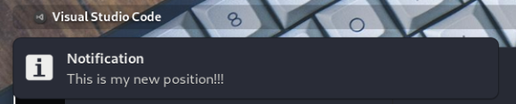

# Gnoti
Changes the position and duration of your notification.

## Previews
**Preview right:**


**Preview left:**



**Preview center:**


## Supported Gnome Shells
- 3.36
- 3.38
- 40

## TODO

- [X] Right corner of the screen
- [X] Left corner of the screen
- [X] Center of the screen
- [X] Display notification permanently until action is taken (click or hover).
- [ ] Menu on top panel.

## Installation
**Warning DO NOT run the scripts if you do not fully understand what it does. Seriously, DON'T!**

**To install**

First you have to clone this repository and navigate inside of it.
```
$ git clone https://gitlab.com/sudo_TuX/gnoti.git
$ cd gnoti/
```

After this you can install Gnoti using `gnoti` as shown below.
```
$ ./gnoti --install [POSITION]
```
You can chose the following positions: **`topright`, `topleft`, `topcenter`**.

After installation, you can choose a new position by simply executing the same command, but with your new desired position.

**To test this extension**

To test this extension you need to install it first, then you can test it by executing the command below, which will simply display a notification.
```
$ ./gnoti --test
```

**To uninstall**

To uninstall this extension there is no specific position required.
```
$ ./gnoti --uninstall
```

## Thanks
I tried to find an extension to move the position of the  notification banner from the center to the right side of the screen and ended up finding [this](https://github.com/brunodrugowick/notification-position-gnome-extension).

But it wasn't compatible with Gnome 40 at the time. So I decided to take a look at [the repo](https://github.com/brunodrugowick/notification-position-gnome-extension) and create my own extension.

## Feedback
This extension isn't perfect therefore suggestions/improvements are always [welcome](https://gitlab.com/sudo_TuX/gnoti/-/issues)!
