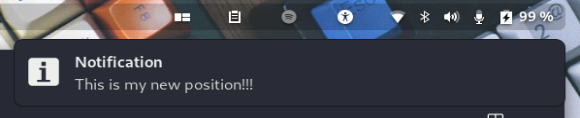

# Gnoti
Changes the position of your notification.

## Preview


## Supported Gnome Shells
- 3.36
- 3.38
- 40

# TODO

- [X] Top-right corner of the screen
- [ ] Bottom-right corner of the screen
- [X] Top-left corner of the screen
- [ ] Bottom-left corner of the screen

## Installation
**Warning DO NOT run the scripts if you do not fully understand what it does. Seriously, DON'T!**

**To install this extension do the following:**
```
$ git clone https://gitlab.com/sudo_TuX/gnoti.git
$ cd gnoti/
$ ./install.sh
```
**To uninstall do the following:**
```
$ ./uninstall.sh
```
**If you want to change the position from the right to the left do the following:**
Change the following line in .local/share/gnome-shell/extensions/Gnoti\@Anton.dev/extension.js:
```
22      Main.messageTray._bannerBin.x = Right.topright();
```
to:
```
22      Main.messageTray._bannerBin.x = Left.topleft();
```
Ater this restart your Gnome Shell with ALT+F2, type 'r' and hit ENTER, alternatively you can also reload the Gnome Shell with the following command:
```
$  busctl --user call org.gnome.Shell /org/gnome/Shell org.gnome.Shell Eval s 'Meta.restart("Restarting…")'
```
**To test the extension you can do the following:**
```
$ ./test.sh
```

## Thanks
I tried to find an extension to move the position of the  notification banner from the center to the right side of the screen and ended up find [this](https://github.com/brunodrugowick/notification-position-gnome-extension).

But it wasn't compatible with Gnome 40 at the time. So I decided to take a look at [the repo](https://github.com/brunodrugowick/notification-position-gnome-extension) and create my own extension.

## Feedback
This extension isn't perfect therefore suggestions/improvements are always [welcome](https://gitlab.com/sudo_TuX/gnoti/-/issues)!